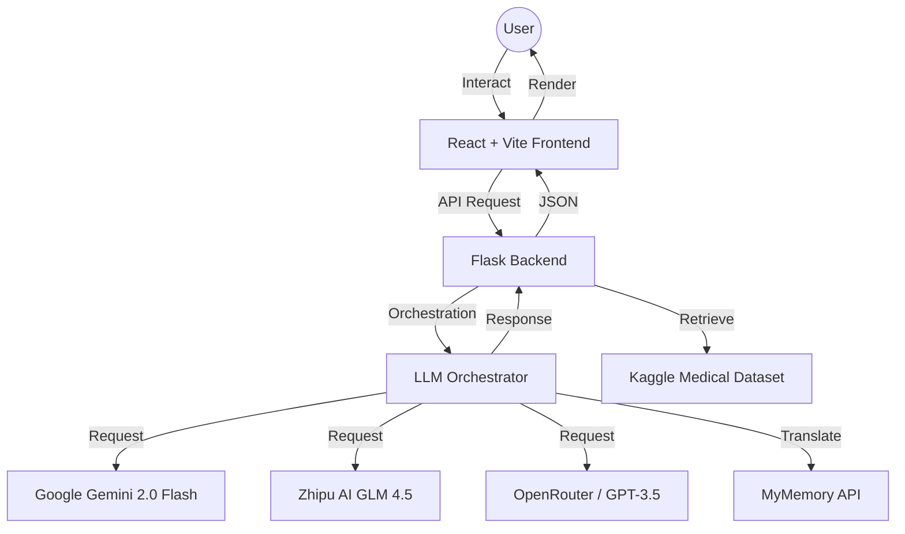

# AI Doctor v3.1: Technical Analysis & Industry Report
## An In-Depth Evaluation of an AI-Driven Healthcare Consultation Platform

**Date:** February 11, 2026  
**Author:** SAHIL G.  
**Version:** 3.1.0  
**Classification:** Industry Grade Technical Report

---

## 1. Executive Summary

AI Doctor v3.1 is a sophisticated health-tech solution designed to bridge the gap between primary symptom assessment and professional medical consultation. By integrating state-of-the-art Large Language Models (LLMs) with an immersive, user-centric interface, the platform provides high-accuracy medical insights, structured treatment suggestions, and multi-model verification. This report details the technical architecture, AI methodology, and UX strategy that define this industry-leading application.

---

## 2. Product Overview

The platform serves as an intelligent first-response system for medical inquiries. Unlike generic chatbots, AI Doctor v3.1 is specifically tuned for clinical data collection and structured response generation.

### Core Value Propositions:
- **Instant Triage:** Immediate assessment of symptoms to determine urgency.
- **Cross-Model Verification:** Multi-LLM "Arena" to reduce AI hallucination risks.
- **Cultural Localization:** Deep multilingual support for diverse demographics (English, Hindi, Marathi).
- **Modern Interaction:** 3D immersion and voice-first capabilities.

---

## 3. Technical Architecture

The system utilizes a modern decoupled architecture, ensuring scalability and performance.

### High-Level System Flow:

### Infrastructure Stack:
- **Frontend:** React 18, TypeScript, Tailwind CSS, Framer Motion, Spline Runtime.
- **Backend:** Flask (Python), concurrent execution for multi-model processing.
- **Deployment:** Vercel (Serverless), providing global edge-latency optimization.

---

## 4. AI Engine & LLM Orchestration

The "brain" of AI Doctor v3.1 is its multi-model orchestration layer.

### Model Arena Strategy:
The platform implements a "Model Arena" where three distinct architectures are leveraged:
1. **Google Gemini 2.0 Flash:** Optimized for speed and high-context reasoning.
2. **GLM 4.5:** Exceptional performance in multilingual and logical reasoning tasks.
3. **GPT-3.5 Turbo (OpenRouter):** Industry-standard reliability for conversational flow.

### Prompt Engineering:
A strictly defined system prompt ensures that all models adhere to a clinical protocol:
- **Variable Collection:** Forced collection of Age, Gender, Duration, and Medical History.
- **Output Structuring:** Mandatory sections including General Treatment, Medical Treatment (Composition-based), and Emergency Escalation triggers.

---

## 5. User Experience & Interface Design

AI Doctor v3.1 prioritizes an "Immersive Industrial" aesthetic.

### Visual Strategy:
- **3D Immersion:** The use of Spline for a 3D robot avatar builds user trust and engagement through high-fidelity visual feedback.
- **Dark Mode Aesthetic:** Reduces eye strain and provides a professional, "high-tech" medical feel.
- **Component Design:** Utilizing shadcn/ui and Radix UI for accessible, keyboard-navigable, and responsive components.

### Interaction Screenshots:

#### Landing Experience
The entry point features a cinematic 3D interaction with a high-fidelity robot avatar, setting a futuristic and professional tone.

#### Intelligent Consultation Interface
A clean, chat-centric interface ("Dr. Vaani") that supports voice input and provides empathetic, context-aware medical responses.

#### Multi-Model Comparative View (The Arena)
Users can instantly compare diagnosis perspectives from three leading LLMs:
- **Gemini (Blue):** Optimized for speed and medical reasoning.
- **GPT (Green):** Focused on conversational accuracy.
- **Claude (Purple):** Specialized in empathetic and detailed guidance.

---

## 6. Multilingual & Accessibility Framework

To achieve true global reach, the platform implements a robust localization layer.

### Translation Pipeline:
- **Real-time API Integration:** Uses the MyMemory API for bidirectional translation.
- **Natural Language Support:** Optimized for English, Hindi, and Marathi, catering to over 1.5 billion potential users.
- **Voice Accessibility:** Integrated Web Speech API for high-quality TTS and STT, enabling use by individuals with visual or motor impairments.

---

## 7. Data Strategy & Knowledge Base

The platform maintains accuracy by referencing the **AI Doctor - BluePlanet** dataset on Kaggle.

### Data Utilization:
- **Keyword Matching:** Pre-defined medical keywords for faster triage.
- **Pharmacological Accuracy:** Ensures that suggested medicines focus on active compositions rather than just brand names, aligning with global medical standards.

---

## 8. Security, Ethics & Compliance

Medical data requires the highest levels of ethical consideration.

- **Privacy-First:** Minimal PII (Personally Identifiable Information) collection.
- **Safety Guardrails:** Hard-coded "When to see a doctor" triggers for high-risk symptoms.
- **Ethical Disclaimer:** Constant visibility of medical disclaimers to manage user expectations and legal compliance.

---

## 9. Future Roadmap

1. **Vision Integration:** Capability to analyze medical reports and images (X-rays, prescriptions).
2. **Wearable Sync:** Real-time vitals monitoring via IoT integration.
3. **Doctor-in-the-Loop:** Seamless handoff to human medical professionals for critical cases.

---

**Conclusion:** AI Doctor v3.1 is not just a chatbot; it is a comprehensive healthcare orchestration platform. Its technical robustness and user-centric design position it as a significant advancement in AI-assisted primary care.
